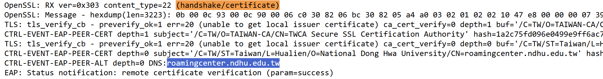

(還在寫)<br>
首先，先使用測試帳號或改過密碼的帳號 (資安緣故)，去下面兩個站點 (擇一) 發起測試。<br>
- 中国科学技术大学<br>
  <https://eduroam.ustc.edu.cn/>
- 中国西安科技大学<br>
  <http://eduroam.seesea.site/>
之後，根據回傳的資訊，決定要使用哪一個模板：<br>
- 僅 PEAP-MSCHAPv2 成功：`eduroam-eap-generic-anonymous-PEAP-MSCHAPv2.eap-config`
- 僅 TTLS-PAP 成功：`eduroam-eap-generic-anonymous-TTLS-PAP.eap-config`
- 兩者都成功：`eduroam-eap-generic-anonymous-Both.eap-config`
- 兩者都失敗：先檢查密碼，或稍後再試，也有可能貴校不支援以上兩種驗證方式。
接著，請在網頁回傳的 log 中，尋找 `(handshake/certificate)`，紀錄 CA 憑證與其 DNS 值。

之後，取代模板以下部分的值 (用文字編輯器)
```
#Domain# -> 用最後的 DNS 值取代
#Realm# -> 你登入帳號 @ 後面那串 (如 mail.edu.tw)，不須包含 @
#Cert# -> Base64 格式的 CA 憑證，可以去 https://crt.sh/ 找
#Name# -> 學校名稱
#Email# -> 學校管理單位 Email
#URL# -> 學校管理單位 URL
#TEL# -> 學校管理單位電話
```